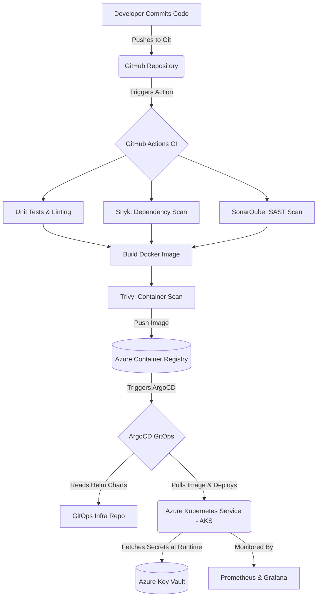

# 🚀 04 — Real-World Pipelines & DevSecOps

A modern CI/CD pipeline is incomplete without integrated security. **DevSecOps** is the practice of shifting security "left"—moving it to the very beginning of the software development lifecycle, rather than treating it as an afterthought just before deployment.

______________________________________________________________________

## 📌 1. Security in the CI/CD Pipeline

To build a "Best in the World" pipeline, you must integrate automated security gates at every possible stage.

### 🔹 1. Pre-Commit / IDE (Shift Left)

Security begins on the developer's laptop.

- **Secret Scanning**: Prevent developers from accidentally committing passwords or API keys to Git using tools like `git-secrets` or Trivy.
- **Linting**: Linters can catch insecure coding practices immediately.

### 🔹 2. Continuous Integration (CI)

When code is pushed, the pipeline must analyze it before it builds.

- **SAST (Static Application Security Testing)**: Scans the raw source code for vulnerabilities (SQL injection, Cross-Site Scripting) without running the code.
  - *Tools*: SonarQube, Checkmarx, Fortify.
- **SCA (Software Composition Analysis)**: Scans your `package.json` or `pom.xml` to find known vulnerabilities in third-party open-source libraries.
  - *Tools*: Snyk, Dependabot, OWASP Dependency-Check.

### 🔹 3. Build & Package

Once the artifact (like a Docker image) is created, it must be scanned.

- **Container Scanning**: Analyzes the layers of the Docker image for vulnerable OS packages or misconfigurations (like running as `root`).
  - *Tools*: Trivy, Clair, Aqua Security.

### 🔹 4. Continuous Deployment (CD)

- **DAST (Dynamic Application Security Testing)**: Scans the running application in a staging environment by simulating simulated attacks (fuzzing, injection) from the outside.
  - *Tools*: OWASP ZAP, Burp Suite.
- **Infrastructure Security**: Scans your Terraform or Kubernetes YAML files for misconfigurations (e.g., leaving a database publicly exposed).
  - *Tools*: Checkov, Kube-bench.

______________________________________________________________________

## 📌 2. Managing Secrets Securely

Never hardcode passwords, API keys, or connection strings in your Git repository or your CI/CD YAML files.

### 🔹 The Correct Way to Handle Secrets:

1. Store all secrets in a centralized, encrypted vault like **Azure Key Vault**, **HashiCorp Vault**, or **AWS Secrets Manager**.
1. Configure your CI/CD pipeline (e.g., GitHub Actions) to authenticate securely with the Vault (using short-lived tokens or Managed Identities).
1. The pipeline fetches the secret at runtime, uses it for deployment, and immediately discards it from memory.

______________________________________________________________________

## 📌 3. End-to-End Enterprise Architecture

Let's visualize how all these pieces fit together in a massive, real-world enterprise environment deploying to Azure.

> [!NOTE]
> In this architecture, if SonarQube or Trivy detect a critical vulnerability, the GitHub Action immediately fails and stops the deployment. The vulnerable Docker image never makes it to the Azure Container Registry.

______________________________________________________________________

> [!TIP]
> **Pro Tip:** When implementing DevSecOps, do not turn on every security tool and block builds immediately. You will overwhelm your developers with "false positives." Start by running scans in "audit-only" mode. Once you have cleaned up the existing codebase, turn on "enforcement" mode to block new vulnerabilities.
