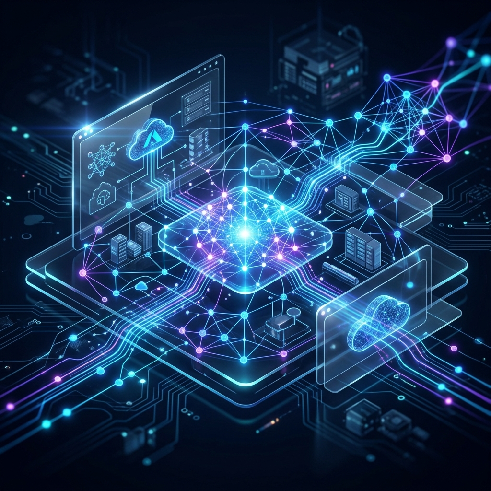
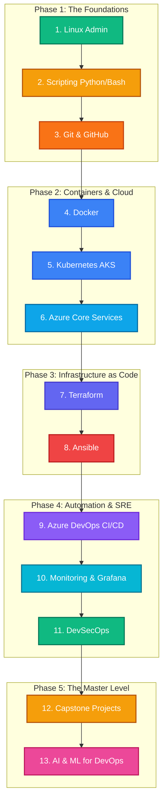

<div align="center">
  
# 🚀 Azure DevOps Roadmap Pro
**A Full-Stack SaaS Learning Platform & AI Mentor Engine**



[](https://vikram512700.github.io/azure-devops-pro/)
[](https://nextjs.org/)
[](https://terraform.io)
[](https://azure.microsoft.com/)

*Built for Senior Azure DevOps & Platform Engineers targeting Hyderabad GCCs.*

</div>

---

## 📖 What is this?

This is **not** just a collection of notes. It is a **portfolio-grade DevOps academy** shaped around daily operations in enterprise platform teams. Every chapter, lab, and AI feature is designed to answer one practical question:

> *"Can you explain it, build it, troubleshoot it, and defend it in an interview?"*

**Unique Angle:** Hyderabad job market intelligence + JD analyzer + LangGraph AI mentor.

---

## 🗺️ The Learning Roadmap (What's Inside)



### 📚 Curriculum Structure
Every learning module follows a strict, interview-ready format:
1. **Theory** (Plain English, AWS equivalency first)
2. **Real World Example** (Enterprise/Jio/O2C context)
3. **Production Architecture** (Hub-Spoke, Private Endpoints)
4. **Hands-On Lab** (KodeKloud-compatible commands)
5. **Troubleshooting** (Real error scenarios and fixes)
6. **Interview Questions** (Basic, Intermediate, Advanced)

---

## ✨ Core Features & AI Agents

- **🧠 AI Mentor Engine (LangGraph)**: Explains concepts, generates dynamic KodeKloud labs, and conducts 4-level mock interviews (Theory → Scenario → Production → Architecture).
- **🎯 JD Skill Gap Analyzer**: Paste any Job Description and get a match score, missing skills breakdown, and a targeted weekly learning plan.
- **🕷️ Market Crawlers**: Automated GitHub Actions to scrape LinkedIn, Naukri, and Indeed India to analyze Hyderabad hiring trends.
- **🏗️ Enterprise Infrastructure**: Fully built with Terraform, AKS, ACR, Key Vault, PostgreSQL Flexible, and Redis.

---

## 🛠️ Monorepo Tech Stack

| Layer | Choice | Reason |
|---|---|---|
| **Frontend** | Next.js 14 App Router | SSR for SEO, extremely fast TTFB |
| **UI** | TailwindCSS + ShadCN | Rapid, accessible, highly premium components |
| **Backend** | NestJS (Node.js) | Modular, TypeScript-native, enterprise-grade |
| **Primary DB** | PostgreSQL | Relational storage for users, courses, and progress |
| **Cache** | Azure Cache for Redis | Session handling and rate limiting |
| **AI** | Gemini API / Azure OpenAI | JD Analyzer, interview engine, lab generator |
| **Infra** | Terraform + AKS + ACR | Portfolio proof of advanced DevOps skills |
| **CI/CD** | Azure Pipelines | 4-stage pipeline: Build → Test → Staging → Prod |

---

## 💻 Local Development

### Prerequisites
- Node.js 18+
- Docker (for full stack)
- Gemini API Key (for AI features)

### Running the App
1. Clone the repo and navigate to the frontend:
   ```bash
   cd frontend
   npm install
   npm run dev
   ```
2. Open `http://localhost:3000` in your browser.
3. To enable AI Features: Go to **Dashboard -> Settings** inside the app and paste your Gemini API Key. (It is stored securely in your local browser storage).

---

## 🤝 Contribution & Usage
- **Docs Tone**: Every chapter reads like a senior engineer explaining how a real system was built. We prioritize "what happened in production" over abstract textbook wording.
- **Secrets**: Never commit secrets. Always use the `.env.local` templates.

> *"Move from 'I know the tool' to 'I can ship the solution.'"*
